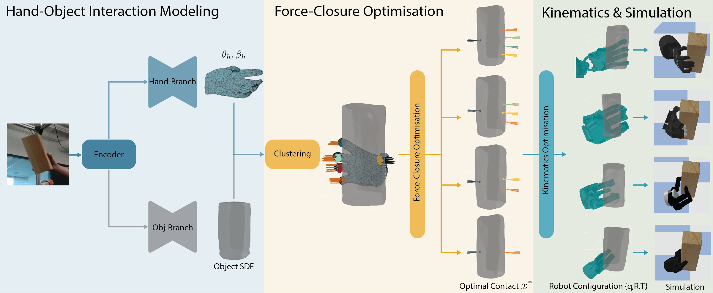

# GenHand 
---

Official codebase for  
 [GenHand: generalised human grasp kinematic retargeting](https://www.nature.com/articles/s44182-026-00076-1).

## Overview

GenHand is a learning-based framework for generalised human-to-robot grasp retargeting.  
It takes human hand and object image as input, and produces robot-specific grasp configurations that preserve contact relationships.




### Repository modules:
- `dataset/`: data loading and preprocessing for DexYCB-based training/testing.
- `network/`: Hand/object pose estimation and mesh reconstruction. Also contains a modified version of [manopth](https://github.com/hassony2/manopth).
- `optimisation/`: grasp optimization with either ground truth input or reconstructed input.
- `simulation/`: PyBullet-based grasp execution and validation.
- `demo/`: a script to quickly run a retargeting demo
- `thirdparty`: contains modified [Pytorch_kinematics](https://github.com/UM-ARM-Lab/pytorch_kinematics) and [Pytorch_volumetric](https://github.com/UM-ARM-Lab/pytorch_volumetric)
### Repository Layout

```text
.
├── dataset/
├── network/
├── optimisation/
├── simulation/
├── demo/
├── urdf/
└── thirdparty/
    ├── pytorch_kinematics/
    └── pytorch_volumetric/
```

### Installation

```bash
conda create -n genhand python=3.7 -y
conda activate genhand
pip install -r requirements.txt
pip install -e .
pip install -e network/manopth
pip install -e thirdparty/pytorch_kinematics
pip install -e thirdparty/pytorch_volumetric
```

### Data and Checkpoints

Please prepare the following resources:

- **Network checkpoint**: 
  please download the pre-trained [checkpoint](https://drive.google.com/file/d/14j6HzB9KbVL2u4i-OAy_Ed9aauvmNnnW/view?usp=drive_link) and put it under `network/ckpt/`. 

- **Robot URDF files**:
   please download the robot [urdf files](https://drive.google.com/file/d/1uwH9Sc5zGj5SaeRDERgrzD0MDKf5WEzO/view?usp=drive_link) and put it under the repo

- **Sample data**:
   we provide a [sample data]( https://drive.google.com/file/d/1Aamr_rfQyt_guiuL_HTQVu_NoB4YUOoT/view?usp=drive_link) for a quick demo, please download and put it under the `dataset/`.


### Run the Demo

Example: Retargeting using ground-truth meshes.

- Method: `genhand` or `baseline`
- Supported robots: `Shadow`, `Allegro`, `Barrett`, `Robotiq`

```bash
python demo/run_demo.py \
    --sdf-source gt_pv \
    --method genhand \
    --cluster-method hdbscan \
    --contact-threshold 0.05 \
    --sample-idx 70 \
    --robot Shadow \
    --device cuda:0 \
    --sim-render GUI
```


### Acknowledgements
This repo is partially build upon [AlignSDF](https://github.com/zerchen/AlignSDF), [DFC](https://github.com/tengyu-liu/diverse-and-stable-grasp), [GenDexGrasp](https://github.com/tengyu-liu/GenDexGrasp). Also shout out to [Pytorch_kinematics](https://github.com/UM-ARM-Lab/pytorch_kinematics), [Pytorch_volumetric](https://github.com/UM-ARM-Lab/pytorch_volumetric), [manopth](https://github.com/hassony2/manopth) and [Dexycb](https://dex-ycb.github.io/) for the wonderful tools and data. Please also consider cite those works.


### TODO
This repository is actively maintained to improve readability and usability. But might move slow due to limited time and resources.

Please open an issue if you have any questions or encounter problems.

### Citation

```text
@article{qi2026genhand,
  title={GenHand: generalised human grasp kinematic retargeting},
  author={Qi, Liyuan and Popoola, Olaoluwa and Imran, Muhammad Ali and Ahmad, Wasim},
  journal={npj Robotics},
  volume={4},
  number={1},
  pages={19},
  year={2026},
  publisher={Nature Publishing Group UK London}
}
```